<!--
title:   痒いところに手が届く！VSCode で快適に Markdown ドキュメントを作成する方法
tags:    Markdown,VSCode
id:      1fe7c45c2f1f2aa666bc
private: true
-->

# はじめに

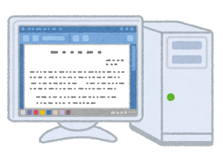

転職してもうすぐ 1 年が経とうとしています。転職前はドキュメントの作成が Word 一択でしたが、転職後は Markdown を使う機会が非常に増えました。

Markdown を使い始めた頃は、編集のしづらさ感じ、利用するメリットをあまり感じていませんでした。

ただ、Markdown を使用することで得られる以下の利点は感じていました。

1. テキストファイルであるため、git での履歴管理が容易
2. GitHub でドキュメントを公開することができる
3. pull request を使って他の人とドキュメントを共同編集できる
4. スタイルを気にせずに書ける

以上のような利点は感じつつも、Word で可能であった以下のようなことができないことが非常にストレスでした。

1. テキスト状態での編集が面倒なときがある（Live Preview したい）
2. 表の作成が面倒
3. 見出し番号を自動で振りたい
4. 画像の挿入が面倒
5. 画像の編集が面倒
6. 図の作成が面倒

とまぁ、こんな感じで、Markdown は Word に比べて編集が面倒だなー、と感じていました。
図表を必要とし、文書構造を見出し番号で管理するようなドキュメントを書くときは、Word がやはり便利だなー、と感じていました。ですが、Visual Studio Code とその拡張機能を使うことで、Word に匹敵する快適な Markdown 編集環境を構築することができました。

ということで、この記事では、Visual Studio Code とその拡張機能を使って Markdown ドキュメントを快適に作成する方法を紹介してみます。

# 必要なアプリケーション、拡張機能

以下のアプリケーション、拡張機能をインストールすることで、Markdown ドキュメントを快適に作成・編集することができます。

- Visual Studio Code
- Typora
- Markdown All in One
- Markdown Preview Enhanced
- Paste Image
- Luna Paint - Image Editor
- Draw.io Integration

## 1. Visual Studio Code

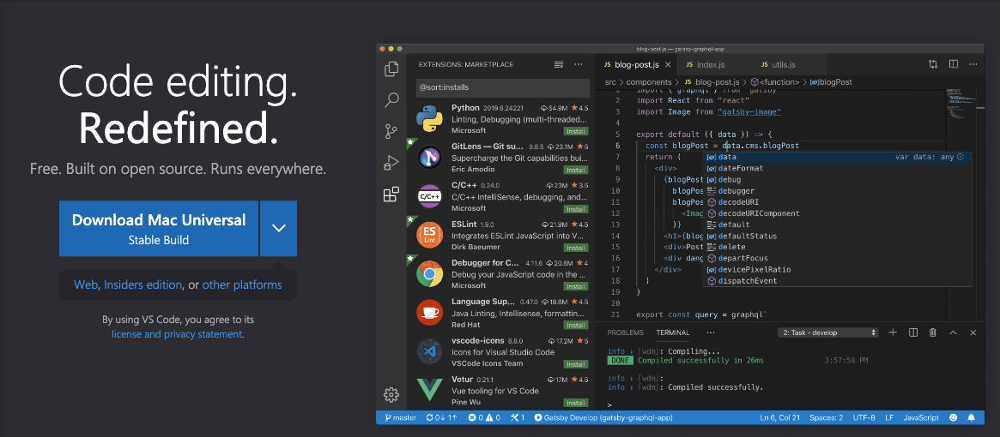

言わずと知れた、マイクロソフト製のテキストエディタです。拡張機能が豊富で、Markdown の編集にも非常に適しています。

以下の URL からダウンロードしてインストールしてください。
[https://code.visualstudio.com/](https://code.visualstudio.com/)

## 2. Typora


Visual Studio Code で Markdown を編集するときに、Live Preview ができると非常に便利です。Typora は、Markdown ファイルをリアルタイムでプレビューすることができる拡張機能です。
また、Visual Studio Code とは別に、有料版のテキストエディタとしても提供されています。

Visual Studio Code を開いて、左側のアイコンから拡張機能を検索し、Typora をインストールしてください。
Typora がインストールされていると、Visual Studio Code で Markdown ファイルを開いたときに、以下の画面が開き、プレビュー状態で編集が可能になります。

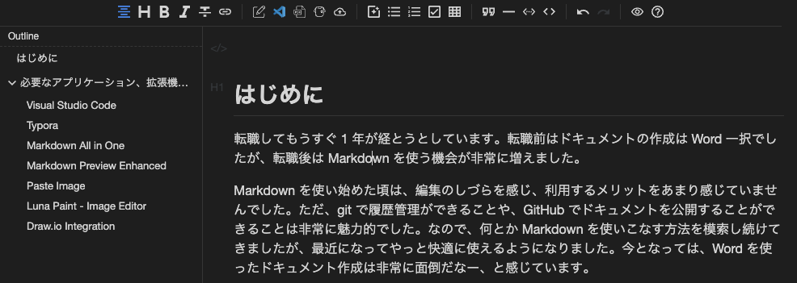

上部のアイコンをクリックすることで、Visual Studio Code のエディタとプレビュー画面を切り替えることができます。
箇条書きやチェックリスト、表などの要素を追加すると、プレビュー画面にリアルタイムで反映されるので、編集が非常に楽になります。

特に表形式の編集が非常に楽になります。Typora で表を作成すると、以下のように見やすい表に変換されます。
もちらん、プレビュー画面で表を編集することが可能です。
列や行の追加がアイコンをクリックするだけでできるのも、非常に便利です。

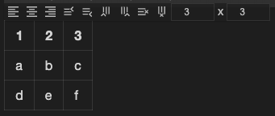

## 3. Markdown All in One

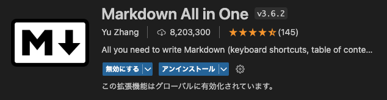

Markdown の編集を快適にするための拡張機能です。Markdown の記法を補完してくれる機能が非常に便利です。その機能の 1 つとして、見出し番号を自動で振ることができます。

Visual Studio Code を開いて、左側のアイコンから拡張機能を検索し、Markdown All in One をインストールしてください。

見出し番号を自動で振るには、`Command + Shift + P` を押して、`Markdown All in One: Add/Update section numbers` を選択してください。

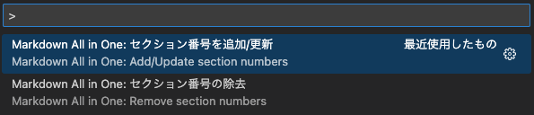

以下のように、見出しを設定し、`Markdown All in One: Add/Update section numbers`を選択すると・・。

```markdown
# 見出し 1

## 見出し 2

### 見出し 3
```

以下のように、見出し番号が自動で振られます。

```markdown
# 1. 見出し 1

## 1.1 見出し 2

### 1.1.1 見出し 3
```

## 4. Markdown Preview Enhanced

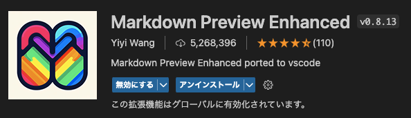

Markdown のプレビューを拡張するための拡張機能です。Markdown のプレビューをリアルタイムで表示することができます。

Visual Studio Code を開いて、左側のアイコンから拡張機能を検索し、Markdown Preview Enhanced をインストールしてください。

Markdown Preview Enhanced をインストールすると、Markdown ドキュメントを右クリックして、`Markdown Preview Enhanced: Open Preview to the Side` を選択することで、プレビュー画面を表示することができます。

また、PDF などの形式でエクスポートすることもできます。

## 5. Paste Image

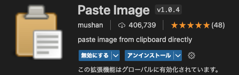

Markdown ドキュメントに画像を挿入するときに、画像を貼り付けるだけで画像の挿入ができる拡張機能です。
ただ、Paste Image に関しては、Visual Studio Code v1.79 で、拡張機能を使わずに Markdown に画像を貼り付ける機能が実装されたので、不要の拡張機能となりました。
[Copy external media files into workspace on drop or paste for Markdown
](https://code.visualstudio.com/updates/v1_79#_copy-external-media-files-into-workspace-on-drop-or-paste-for-markdown)

Visual Studio Code v1.79 以降を使用している場合は、キャプチャした画像を Markdown ドキュメントに貼り付けると、画像が自動で保存されるので、非常に便利です。

`settings.json` に以下の設定を追加することで、画像の保存先を「images/ドキュメント名/」に設定することができます。

```json
  "markdown.copyFiles.destination": {
    "/**/*": "images/${documentBaseName}/"
  },
```

これにより、画像を Markdown ドキュメントに貼り付けると、Markdown ファイルから相対パスでフォルダ`images/ドキュメント名/`に画像が保存されます。

## 6. Luna Paint - Image Editor

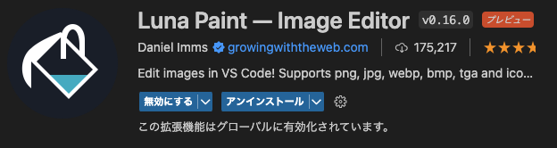

Markdown ドキュメントに画像を挿入するときに、画像の編集が必要な場合があります。Luna Paint - Image Editor は、画像の編集ができる拡張機能です。

Visual Studio Code を開いて、左側のアイコンから拡張機能を検索し、Luna Paint - Image Editor をインストールしてください。

Luna Paint - Image Editor をインストールすると、以下の手順で画像の編集ができます。

1. 画像を右クリックして、`ファイルを開くアプリケーションの選択...`を選択
2. `Luna Paint Image Editor` を選択
3. 画像を編集し、`Ctrl + S` で保存

テキストを追加したり、図形を追加したり、画像のリサイズやトリミングなどができます。

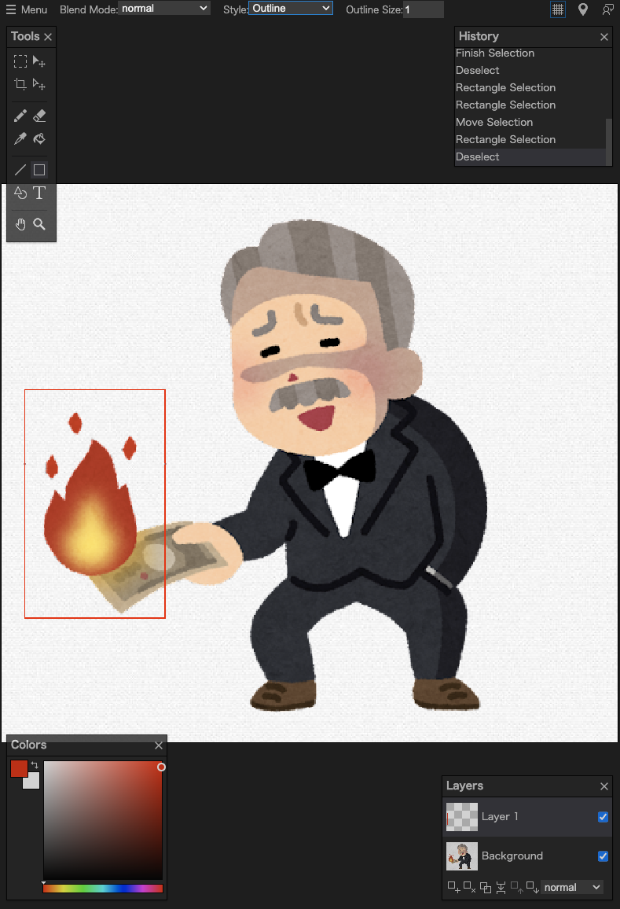

## 7. Draw.io Integration

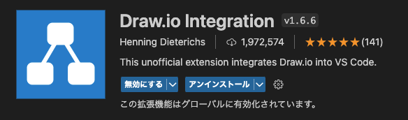

Draw.io は、図を作成するためのツールです。
そして、Draw.io Integration は、Visual Studio Code で Draw.io を利用するための拡張機能です。

Visual Studio Code を開いて、左側のアイコンから拡張機能を検索し、Draw.io Integration をインストールしてください。

Draw.io Integration をインストールすると、以下の手順で図を作成することができます。

1. 画像を保存しているフォルダに、`*.drawio.svg` ファイルを作成
2. 作成したファイルを開き、編集する。
3. 編集したファイルのパスを Markdown ドキュメントに記述

下図のように、Draw.io 作図します。
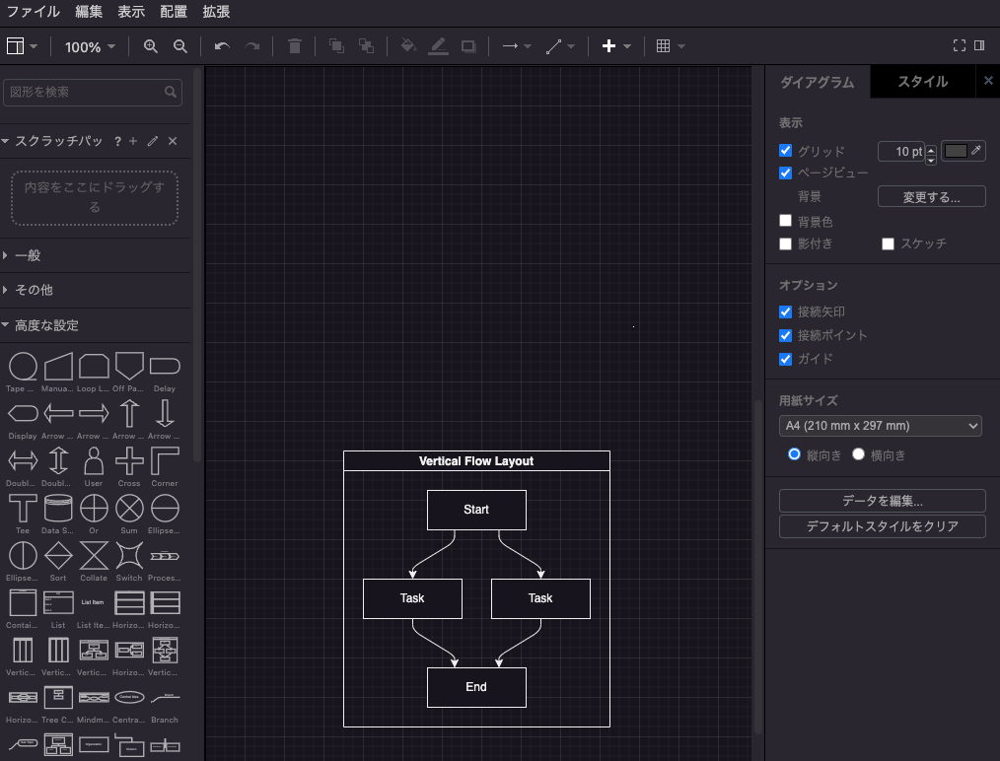

<br>

編集したファイルのパスを Markdown ドキュメントに記述します。

<br>

```markdown
```

<br>

そうすることで、以下のような図が Markdown ドキュメントに挿入されます。


<br>

図の修正が必要になれば、`*.drawio.svg` ファイルを編集することで、自動で Markdown ドキュメントに反映されます。

また、`*.drawio.png`というファイルを作成することで、PNG 形式の画像を作成することもできます。
個人的には、Lua Paint よりも Draw.io を使用したほうが画像の加工がし易いです。

ちなみに、下の画像は以下の手順で作成しました。

1. `hogehoge.drawio.png` というファイルを新規作成
2. 作成したファイルを開き、コピーした画像を貼り付け
3. 吹き出し図を挿入し、テキストを追加
4. 画像を保存
5. 作成したファイルのパスを Markdown ドキュメントに記述


# まとめ

ということで、Visual Studio Code とその拡張機能を使って Markdown ドキュメントを快適に作成する方法を紹介しました。
いかがでしたでしょうか？紹介した拡張機能等を駆使することで Markdown でのドキュメント作成が非常に快適になると思います。

それでは、Markdown でのドキュメント作成を楽しんでください！
