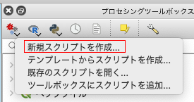
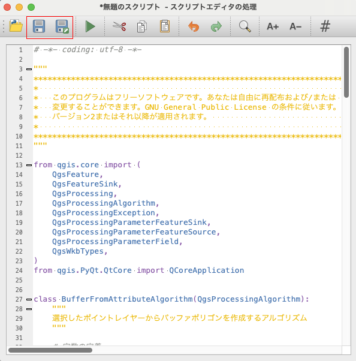
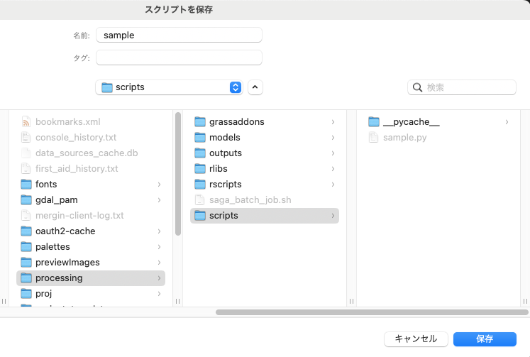
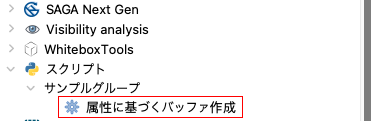
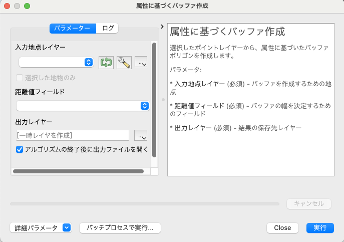
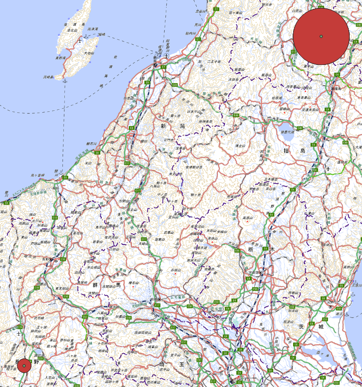

<!--
title:   QGISでサクッとプロセッシングツールを作成しよう
tags:    GIS,Python,QGIS
private: true
-->

# はじめに

QGIS を使っていると、プラグインを作成するまでもないが、サクッとツールを作成したい時があります。
そんな時は、以下の手順でプロセシングツールボックスに自作のツールを追加することができます。

# プロセシングツールボックスにツールを追加する

以下のコードのように、QGIS のプロセシングアルゴリズムを継承したクラスを作成し、その中で処理を記述します。
コメントを適宜書いてあるので、参考にしてください。

ちなみにこのコードでは、選択したポイントレイヤーからバッファポリゴンを作成するアルゴリズムを作成しています。
バッファの距離は、ポイントレイヤーの属性に基づいて決定します。

```python
# -*- coding: utf-8 -*-

"""
***************************************************************************
*                                                                         *
*   このプログラムはフリーソフトウェアです。あなたは自由に再配布および/または   *
*   変更することができます。GNU General Public License の条件に従います。     *
*   バージョン2またはそれ以降が適用されます。                              *
*                                                                         *
***************************************************************************
"""

from qgis.core import (
    QgsFeature,
    QgsFeatureSink,
    QgsProcessing,
    QgsProcessingAlgorithm,
    QgsProcessingException,
    QgsProcessingParameterFeatureSink,
    QgsProcessingParameterFeatureSource,
    QgsProcessingParameterField,
    QgsWkbTypes,
)
from qgis.PyQt.QtCore import QCoreApplication


class BufferFromAttributeAlgorithm(QgsProcessingAlgorithm):
    """
    選択したポイントレイヤーからバッファポリゴンを作成するアルゴリズム
    """

    # 定数の定義
    INPUT_POINTS = "INPUT_POINTS"
    DISTANCE_FIELD = "DISTANCE_FIELD"
    OUTPUT_LAYER = "OUTPUT_LAYER"

    def tr(self, string):
        """
        翻訳可能な文字列を返すヘルパー関数
        """
        return QCoreApplication.translate("Processing", string)

    def createInstance(self):
        return BufferFromAttributeAlgorithm()

    def name(self):
        """
        アルゴリズムの識別名を返す
        """
        return "buffer_from_attribute"

    def displayName(self):
        """
        ユーザーが見るためのアルゴリズムの名前を返す
        """
        return self.tr("属性に基づくバッファ作成")

    def group(self):
        """
        アルゴリズムが所属するグループ名を返す
        """
        return self.tr("サンプルグループ")

    def groupId(self):
        """
        グループの一意のIDを返す
        """
        return "sample_group"

    def shortHelpString(self):
        """
        アルゴリズムの簡単な説明を返す
        """
        return self.tr(
            """選択したポイントレイヤーから、属性に基づいたバッファポリゴンを作成します。

            パラメータ:

             * <b>入力地点レイヤー</b> (必須) - バッファを作成するための地点
             * <b>距離値フィールド</b> (必須) - バッファの幅を決定するためのフィールド
             * <b>出力レイヤー</b> (必須) - 結果の保存先レイヤー
            """
        )

    def initAlgorithm(self, config=None):
        """
        アルゴリズムの入力と出力を定義する
        """
        self.addParameter(
            QgsProcessingParameterFeatureSource(
                self.INPUT_POINTS,
                self.tr("入力地点レイヤー"),
                [QgsProcessing.TypeVectorPoint],
            )
        )
        self.addParameter(
            QgsProcessingParameterField(
                self.DISTANCE_FIELD,
                self.tr("距離値フィールド"),
                None,
                self.INPUT_POINTS,
                QgsProcessingParameterField.Numeric,
                False,
            )
        )
        self.addParameter(
            QgsProcessingParameterFeatureSink(
                self.OUTPUT_LAYER,
                self.tr("出力レイヤー"),
                QgsProcessing.TypeVectorAnyGeometry,
            )
        )

    def processAlgorithm(self, parameters, context, feedback):
        """
        実際の処理を行う部分
        """
        source_pts = self.parameterAsSource(parameters, self.INPUT_POINTS, context)
        distance_field = self.parameterAsString(parameters, self.DISTANCE_FIELD, context)

        if source_pts is None:
            raise QgsProcessingException(self.invalidSourceError(parameters, self.INPUT_POINTS))

        feedback.pushInfo("入力データを読み込みました。バッファを作成中...")
        feedback.setProgress(1)

        # 出力レイヤーを作成
        fields = source_pts.fields()
        (sink, dest_id) = self.parameterAsSink(
            parameters,
            self.OUTPUT_LAYER,
            context,
            fields,
            QgsWkbTypes.Polygon,
            source_pts.sourceCrs(),
        )

        if sink is None:
            raise QgsProcessingException(self.invalidSinkError(parameters, self.OUTPUT_LAYER))

        for source_pt in source_pts.getFeatures():
            if feedback.isCanceled():
                break

            # ポイントフィーチャから距離値を取得
            distance = source_pt[distance_field]
            geom = source_pt.geometry()

            feedback.pushInfo(
                "地点({:.2f}, {:.2f})のバッファを作成中 - 距離: {}".format(
                    geom.asPoint().x(), geom.asPoint().y(), distance
                )
            )

            # ポイントフィーチャからバッファを作成
            buffer_geom = geom.buffer(distance, 10)
            buffer_feature = QgsFeature(fields)
            buffer_feature.setGeometry(buffer_geom)
            buffer_feature.setAttributes(source_pt.attributes())

            sink.addFeature(buffer_feature, QgsFeatureSink.FastInsert)

            feedback.setProgress(
                int((source_pt.id() + 1) / source_pts.featureCount() * 100)
            )

        return {self.OUTPUT_LAYER: dest_id}
```

ちなみに、プロセシングパラメータについては、以下の記事が詳しいです！
[QGIS におけるプロセシングプラグインのパラメータ](https://qiita.com/kntoshiya/items/649bb11123a110750727)

コードを作成したら、プロセシングツールボックスの Python アイコンをクリックし、「新規スクリプトを作成...」をクリックします。



そしたらスクリプトエディタにコピペします。
コピペしたら保存ボタンをクリックします。



processing > scripts の中にお好きな名前で Python スクリプトを保存します。



これでプロセシングツールボックスに自作のツールが追加されました！
作ったツールをクリックしてみましょう！



プロセシングツールが表示されました。
パラメータを設定して実行ボタンをクリックすると、処理が実行されます。



属性値に基づいたバッファポリゴンが作成されました！



# まとめ

このように、QGIS では簡単にオリジナルのプロセシングツールを作成することができます。
みなさんもぜひ、自分の作業を効率化するためのツールを作成してみてください！
