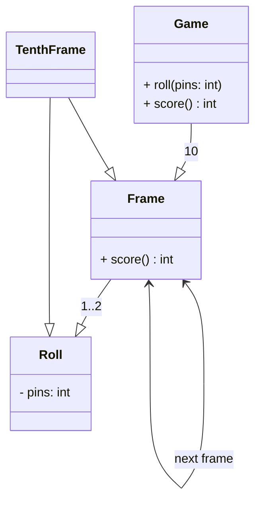

<!--
title:   TDD道場： Bowling Game KataをPythonで実装する
tags:    Python, TDD, pytest
id:
private: true
-->

# はじめに

TDD (Test-Driven Development) Kata とは、TDD の練習やスキル向上のために行う小さなプログラミング練習問題のことです。「カタ」は武道や芸術における型（練習方法）に由来し、繰り返し実践することで、TDD の基本的なステップを習得できるように設計されています。

以下のサイトで、様々な Kata の問題が公開されています。
https://kata-log.rocks/

今回は[Bowling Game Kata](https://kata-log.rocks/bowling-game-kata)を Python で実装してみます。

# Bowling Game Kata

## Bowling Rules

ボーリングのルールは以下の通りです。原文を翻訳したものを示します。

-   ボウリングのルール ゲームは 10 フレームで構成されています。
-   各フレームでプレイヤーは 2 回ボールを投げて、10 本のピンを倒します。
-   フレームのスコアは、倒したピンの合計数に、ストライクやスペアのボーナスが加算されます。

-   スペアは、プレイヤーが 2 回の投球で 10 本すべてのピンを倒した場合です。
    -   このフレームのボーナスは、次の 1 回の投球で倒したピンの数です。
-   ストライクは、プレイヤーが最初の投球で 10 本すべてのピンを倒した場合です。

    -   このフレームは 1 回の投球で完了します。このフレームのボーナスは、次の 2 回の投球で倒したピンの数です。

-   第 10 フレームでは、プレイヤーがスペアまたはストライクを出した場合、そのフレームを完了するために追加の投球が許されます。
    -   ただし、第 10 フレームでは最大 3 回の投球までしかできません。

## Requirements

クラス Game を作成し、2 つのメソッドを持たせてください。原文を翻訳したものを示します。

-   `void roll(int)`：プレイヤーがボールを投げるたびに呼び出されます。引数は倒したピンの数です。
-   `int score()`：そのゲームの合計スコアを返します。

## それでは実践していきます

今回の問題は、作者が解説資料を PPT で提示してくれています。
なので、その内容を参考にしながら進めていきます。解説資料は java で説明されており、以下からアクセスできます。

http://www.butunclebob.com/files/downloads/Bowling%20Game%20Kata.ppt

以下のクラス図を参考に、TDD していきます。



### Begin

まずはパッケージ管理ツールである`uv`でプロジェクトを作成します。

```bash
uv init
```

次に、テストフレームワークである`pytest`をインストールします。

```bash
uv add pytest
```

### The First test.

さっそくテストを書いていきます。まずは、`test_bowling_game.py`を作成します。

`test_bowling_game.py`

```python
from bowling_game import Game


def test_gutter_game():
    game = Game()
```

`bowling_game.py`を作成します。

`bowling_game.py`

```python
class Game:
    pass
```

テストを実行します。

```bash
uv run pytest

> ================== test session starts  ==================
> platform darwin -- Python 3.12.6, pytest-8.3.3, pluggy-1.5.0
> rootdir: .
> configfile: pyproject.toml
> collected 1 item

> test_bowling_game.py .                                                                                                                  [100%]

> ================== 1 passed in 0.00s ==================
```

テストがまずは通りました。

`roll` メソッドを実装していきます。

`test_bowling_game.py`

```diff
from bowling_game import Game


def test_gutter_game():
    game = Game()
+    for i in range(20):
+        game.roll(0)
```

`bowling_game.py`

```diff
class Game():
+    def roll(self, pins: int):
+        pass
```

`score` メソッドを実装していきます。

`test_bowling_game.py`

```diff
from bowling_game import Game


def test_gutter_game():
    game = Game()
    for i in range(20):
        game.roll(0)
+    assert game.score() == 0
```

問答無用に`-1`を返すように実装します。

`bowling_game.py`

```diff
class Game():
    def roll(self, pins: int):
        pass

+    def score(self) -> int:
+        return -1
```

それでは、すべての roll で倒したピンが 0 本の場合のテストを実行してみます。
すると以下のエラーが発生します。`0`を期待していたが、`-1`が返ってきていることがわかります。

```bash
uv run pytest -v

~~省略~~
> ================== test_bowling_game ==================
>
>     def test_gutter_game():
>         game = Game()
>         for i in range(20):
>             game.roll(0)
> >       assert game.score() == 0
> E       assert -1 == 0
> E        +  where -1 = score()
> E        +    where score = <bowling_game.Game object at 0x1033fc1a0>.score
~~省略~~
```

`score` メソッドを修正して、`0`を返すようにします。

`bowling_game.py`

```diff
class Game():
    def roll(self, pins: int):
        pass

    def score(self) -> int:
+        return 0
```

再度テストを実行します。

```bash
uv run pytest -v

~~省略~~
test_bowling_game.py::test_bowling_game PASSED  [100%]

================== 1 passed in 0.00s ==================
~~省略~~
```

### The Second test.

すべての roll で倒したピンが 1 本の場合のテストを追加します。

`test_bowling_game.py`

```diff
from bowling_game import Game


def test_gutter_game():
    game = Game()
    for i in range(20):
        game.roll(0)
    assert game.score() == 0

+ def test_all_ones():
+     game = Game()
+     for i in range(20):
+         game.roll(1)
+     assert game.score() == 20
```

テストを実行します。
エラーが発生します。

```bash
uv run pytest -v

~~省略~~
> >       assert game.score() == 20
> E       assert 0 == 20
> E        +  where 0 = score()
> E        +    where score = <bowling_game.Game object at 0x1019aa360>.score

> test_bowling_game.py:14: AssertionError
> ================== short test summary info ===================
> FAILED test_bowling_game.py::test_all_ones - assert 0 == 20
> ================ 1 failed, 1 passed in 0.02s =================
```

`bowling_game.py`を修正します。

`bowling_game.py`

```diff
class Game():
+    def __init__(self):
+        self._score = 0

    def roll(self, pins: int):
-        pass
+        self._score += pins

    def score(self) -> int:
-        return 0
+        return _self.score
```

テストを再度実行します。
テストが通りました。

```bash
uv run pytest -v

~~省略~~
> test_bowling_game.py::test_bowling_game PASSED                     [ 50%]
> test_bowling_game.py::test_all_ones PASSED                         [100%]

> =========================== 2 passed in 0.00s ============================
```

テストコードで、`Game`クラスのインスタンスが 2 回作成されています。リファクタリングしていきます。

`test_bowling_game.py`

```diff
+ import pytest

from bowling_game import Game


+ @pytest.fixture
+ def game():
+     return Game()

- def test_gutter_game():
+ def test_gutter_game(game):
-    game = Game()
    for i in range(20):
        game.roll(0)
    assert game.score() == 0

- def test_all_ones():
+ def test_all_ones(game):
-    game = Game()
    for i in range(20):
        game.roll(1)
    assert game.score() == 20
```

テストを実行し、問題ないことを確認します。

```bash
uv run pytest -v

~~省略~~
> test_bowling_game.py::test_bowling_game PASSED                     [ 50%]
> test_bowling_game.py::test_all_ones PASSED                         [100%]

> =========================== 2 passed in 0.00s ============================
```

リファクタリングしていきます。

`test_bowling_game.py`

```diff
import pytest

from bowling_game import Game


@pytest.fixture
def game():
    return Game()

def test_gutter_game(game):
-   for i in range(20):
-       game.roll(0)
+    total_rolls = 20
+    num_hit_pins = 0
+    for i in range(total_rolls):
+        game.roll(num_hit_pins)
    assert game.score() == 0

def test_all_ones(game):
    for i in range(20):
        game.roll(1)
    assert game.score() == 20
```

さらにリファクタリングしていきます。

`test_bowling_game.py`

```diff
import pytest

from bowling_game import Game


@pytest.fixture
def game():
    return Game()

def test_gutter_game(game):
    total_rolls = 20
    num_hit_pins = 0
+    game = roll_many(game, total_rolls, num_hit_pins)
    assert game.score() == 0

+ def roll_many(game: Game, total_rolls: int, num_hit_pins: int):
+     for i in range(total_rolls):
+         game.roll(num_hit_pins)
+
+     return game

def test_all_ones(game):
    for i in range(20):
        game.roll(1)
    assert game.score() == 20
```

これも問題ないことを確認します。

```bash
uv run pytest -v

~~省略~~
> test_bowling_game.py::test_bowling_game PASSED                     [ 50%]
> test_bowling_game.py::test_all_ones PASSED                         [100%]

> =========================== 2 passed in 0.00s ============================
```

さらにリファクタリングしていきます。

`test_bowling_game.py`

```diff
import pytest

from bowling_game import Game


@pytest.fixture
def game():
    return Game()

def test_gutter_game(game):
-    total_rolls = 20
-    num_hit_pins = 0
-    game = roll_many(game, total_rolls, num_hit_pins)
+    game = roll_many(game, 20, 0)
    assert game.score() == 0

def roll_many(game: Game, total_rolls: int, num_hit_pins: int):
    for i in range(total_rolls):
        game.roll(num_hit_pins)

    return game

def test_all_ones(game):
-     for i in range(20):
-         game.roll(1)
+    roll_many(game, 20, 1)
    assert game.score() == 20
```

テストが問題なく通ることを確認し、再度リファクタリングしていきます。関数の順序を入れ替えます。

`test_bowling_game.py`

```python
import pytest

from bowling_game import Game


@pytest.fixture
def game():
    return Game()

def roll_many(game: Game, total_rolls: int, num_hit_pins: int):
    for i in range(total_rolls):
        game.roll(num_hit_pins)

    return game

def test_gutter_game(game):
    game = roll_many(game, 20, 0)
    assert game.score() == 0

def test_all_ones(game):
    roll_many(game, 20, 1)
    assert game.score() == 20
```

### The Third test.

spare に関するテストを追加します。

`test_bowling_game.py`

```diff
import pytest

from bowling_game import Game


@pytest.fixture
def game():
    return Game()

def roll_many(game: Game, total_rolls: int, num_hit_pins: int):
    for i in range(total_rolls):
        game.roll(num_hit_pins)

    return game

def test_gutter_game(game):
    game = roll_many(game, 20, 0)
    assert game.score() == 0

def test_all_ones(game):
    roll_many(game, 20, 1)
    assert game.score() == 20

+ def test_one_spare(game):
+     game.roll(5)
+     game.roll(5) # spare
+     game.roll(3)
+     roll_many(game, 17, 0)
+     assert game.score() == 16
```

テストを実行すると、エラーが発生します。

```bash
uv run pytest -v

~~省略~~
>       assert game.score() == 16
E       assert 13 == 16
E        +  where 13 = score()
E        +    where score = <bowling_game.Game object at 0x101587fe0>.score

test_bowling_game.py:29: AssertionError
======================== short test summary info =========================
FAILED test_bowling_game.py::test_one_spare - assert 13 == 16
====================== 1 failed, 2 passed in 0.02s =======================
```

`bowling_game.py`のデザインなどがよくないので、修正していきます。

-   まず、`roll`メソッドは score を計算しています。ですが、名前が不適切です。
-   `score`メソッドは、score を計算していません。名前が不適切です。

まずは、追加したテストこコメントアウトして、テストが通ることを確認してください。

`test_bowling_game.py`

```python
import pytest

from bowling_game import Game


@pytest.fixture
def game():
    return Game()

def roll_many(game: Game, total_rolls: int, num_hit_pins: int):
    for i in range(total_rolls):
        game.roll(num_hit_pins)

    return game

def test_gutter_game(game):
    game = roll_many(game, 20, 0)
    assert game.score() == 0

def test_all_ones(game):
    roll_many(game, 20, 1)
    assert game.score() == 20

# def test_one_spare(game):
#     game.roll(5)
#     game.roll(5) # spare
#     game.roll(3)
#     roll_many(game, 17, 0)
#     assert game.score() == 16
```

`bowling_game.py`を修正します。

```diff
class Game():
    def __init__(self):
+        self._score: int = 0
+        self._rolls: list[int] = [0 for _ in range(21)]
+        self._current_roll: int = 0

    def roll(self, pins: int):
        self._score += pins
+        self._rolls[self._current_roll] = pins
+        self._current_roll += 1

    def score(self) -> int:
        return self._score
```

テストを実行します。

```bash
uv run pytest -v

~~省略~~
test_bowling_game.py::test_gutter_game PASSED                      [ 50%]
test_bowling_game.py::test_all_ones PASSED                         [100%]

=========================== 2 passed in 0.00s ============================
```

さらに修正します。

`bowling_game.py`

```diff
class Game():
    def __init__(self):
        self._score: int = 0
        self._rolls: list[int] = [0 for _ in range(21)]
        self._current_roll: int = 0

    def roll(self, pins: int):
        self._score += pins
        self._rolls[self._current_roll] = pins
        self._current_roll += 1

    def score(self) -> int:
-        return self._score
+        score: int = 0
+        for roll_point in self._rolls:
+            score += roll_point
+        return score
```

テストが通ることを確認します。

```bash
uv run pytest -v

~~省略~~
test_bowling_game.py::test_gutter_game PASSED            [ 50%]
test_bowling_game.py::test_all_ones PASSED               [100%]

====================== 2 passed in 0.01s =======================
```

不要な部分を削除します。

`bowling_game.py`

```diff
class Game():
    def __init__(self):
-       self._score: int = 0
        self._rolls: list[int] = [0 for _ in range(21)]
        self._current_roll: int = 0

    def roll(self, pins: int):
-       self._score += pins
        self._rolls[self._current_roll] = pins
        self._current_roll += 1

    def score(self) -> int:
        score: int = 0
        for roll_point in self._rolls:
            score += roll_point
        return score
```

テストが通ることを確認します。

```bash
uv run pytest -v

~~省略~~
test_bowling_game.py::test_gutter_game PASSED            [ 50%]
test_bowling_game.py::test_all_ones PASSED               [100%]

====================== 2 passed in 0.01s =======================
```

テストコードのコメントアウトを外します。

`test_bowling_game.py`

```python
import pytest

from bowling_game import Game


@pytest.fixture
def game():
    return Game()

def roll_many(game: Game, total_rolls: int, num_hit_pins: int):
    for i in range(total_rolls):
        game.roll(num_hit_pins)

    return game

def test_gutter_game(game):
    game = roll_many(game, 20, 0)
    assert game.score() == 0

def test_all_ones(game):
    roll_many(game, 20, 1)
    assert game.score() == 20

def test_one_spare(game):
    game.roll(5)
    game.roll(5) # spare
    game.roll(3)
    roll_many(game, 17, 0)
    assert game.score() == 16
```

再度テストを実行します。
エラーを確認します。

```bash
uv run pytest -v

> test_bowling_game.py::test_gutter_game PASSED            [ 33%]
> test_bowling_game.py::test_all_ones PASSED               [ 66%]
> test_bowling_game.py::test_one_spare FAILED              [100%]
>
> =========================== FAILURES ===========================
> ________________________ test_one_spare ________________________
>
> game = <bowling_game.Game object at 0x102cdae40>
>
>     def test_one_spare(game):
>         game.roll(5)
>         game.roll(5) # spare
>         game.roll(3)
>         roll_many(game, 17, 0)
> >       assert game.score() == 16
> E       assert 13 == 16
> E        +  where 13 = score()
> E        +    where score = <bowling_game.Game object at 0x102cdae40>.score
>
> test_bowling_game.py:29: AssertionError
> =================== short test summary info ====================
> FAILED test_bowling_game.py::test_one_spare - assert 13 == 16
> ================= 1 failed, 2 passed in 0.01s ==================
```

いったん以下で実装してみます。

`bowling_game.py`

```diff
class Game():
    def __init__(self):
        self._rolls: list[int] = [0 for _ in range(21)]
        self._current_roll: int = 0

    def roll(self, pins: int):
        self._rolls[self._current_roll] = pins
        self._current_roll += 1

    def score(self) -> int:
        score: int = 0
+       i: int = 0
+       for frame in range(10):
+           score += self._rolls[i] + self._rolls[i + 1]
+           i += 2
        return score
```

テストを実行します。
エラーが発生します。

```bash
uv run pytest -v

~~省略~~
> test_bowling_game.py::test_gutter_game PASSED                      [ 33%]
> test_bowling_game.py::test_all_ones PASSED                         [ 66%]
> test_bowling_game.py::test_one_spare FAILED                        [100%]
>
> ================================ FAILURES ================================
> _____________________________ test_one_spare _____________________________
>
> game = <bowling_game.Game object at 0x100bdffe0>
>
>     def test_one_spare(game):
>         game.roll(5)
>         game.roll(5) # spare
>         game.roll(3)
>         roll_many(game, 17, 0)
> >       assert game.score() == 16
> E       assert 13 == 16
> E        +  where 13 = score()
> E        +    where score = <bowling_game.Game object at 0x100bdffe0>.score
>
> test_bowling_game.py:29: AssertionError
> ======================== short test summary info =========================
> FAILED test_bowling_game.py::test_one_spare - assert 13 == 16
> ====================== 1 failed, 2 passed in 0.01s =======================
```

コードを修正します。

`bowling_game.py`

```diff
class Game():
    def __init__(self):
        self._rolls: list[int] = [0 for _ in range(21)]
        self._current_roll: int = 0

    def roll(self, pins: int):
        self._rolls[self._current_roll] = pins
        self._current_roll += 1

    def score(self) -> int:
        score: int = 0
        i: int = 0
        for frame in range(10):
+           if (self._rolls[i] + self._rolls[i + 1] == 10):
+               score += 10 + self._rolls[i + 2]
+               i += 2
+           else:
               score += self._rolls[i] + self._rolls[i + 1]
               i += 2
        return score
```

テストを実行します。
テストが通りました！

```bash
uv run pytest -v

~~省略~~
> test_bowling_game.py::test_gutter_game PASSED                      [ 33%]
> test_bowling_game.py::test_all_ones PASSED                         [ 66%]
> test_bowling_game.py::test_one_spare PASSED                        [100%]
>
> =========================== 3 passed in 0.00s ============================
```

テストが通ったので、リファクタリングしていきます。
変数名は適切なものに変更します。
`i`を`frame_index`に変更します。

`bowling_game.py`

```python
class Game():
    def __init__(self):
        self._rolls: list[int] = [0 for _ in range(21)]
        self._current_roll: int = 0

    def roll(self, pins: int):
        self._rolls[self._current_roll] = pins
        self._current_roll += 1

    def score(self) -> int:
        score: int = 0
        frame_index: int = 0
        for frame in range(10):
            if (self._rolls[frame_index] + self._rolls[frame_index + 1] == 10):
                score += 10 + self._rolls[frame_index + 2]
                frame_index += 2
            else:
                score += self._rolls[frame_index] + self._rolls[frame_index + 1]
                frame_index += 2
        return score
```

テストを実行し問題ないことを確認します。

```bash
uv run pytest -v

~~省略~~
> =========================== 3 passed in 0.00s ============================
```

リファクタリングしていきます。

`bowling_game.py`

```diff
class Game():
    def __init__(self):
        self._rolls: list[int] = [0 for _ in range(21)]
        self._current_roll: int = 0

    def roll(self, pins: int):
        self._rolls[self._current_roll] = pins
        self._current_roll += 1

    def score(self) -> int:
        score: int = 0
        frame_index: int = 0
        for frame in range(10):
-          if (self._rolls[frame_index] + self._rolls[frame_index + 1] == 10):
+           if self.is_spare(frame_index):
                score += 10 + self._rolls[frame_index + 2]
                frame_index += 2
            else:
                score += self._rolls[frame_index] + self._rolls[frame_index + 1]
                frame_index += 2
        return score

+   def is_spare(self, frame_index: int) -> bool:
+       return self._rolls[frame_index] + self._rolls[frame_index + 1] == 10
```

テストが通ることを確認します。

```bash
uv run pytest -v

~~省略~~
> =========================== 3 passed in 0.00s ============================
```

テストコードもリファクタリングしていきます。

`test_bowling_game.py`

```diff
import pytest

from bowling_game import Game


@pytest.fixture
def game():
    return Game()

def roll_many(game: Game, total_rolls: int, num_hit_pins: int):
    for i in range(total_rolls):
        game.roll(num_hit_pins)

    return game

def test_gutter_game(game):
    game = roll_many(game, 20, 0)
    assert game.score() == 0

def test_all_ones(game):
    roll_many(game, 20, 1)
    assert game.score() == 20

def test_one_spare(game):
-   game.roll(5)
-   game.roll(5) # spare
+   game = roll_spare(game)
    game.roll(3)
    roll_many(game, 17, 0)
    assert game.score() == 16

+ def roll_spare(game: Game):
+     game.roll(5)
+     game.roll(5)
+     return game
```

### The Forrth test.

Strike に関するテストを追加します。

`test_bowling_game.py`

```diff
import pytest

from bowling_game import Game


@pytest.fixture
def game():
    return Game()

def roll_many(game: Game, total_rolls: int, num_hit_pins: int):
    for i in range(total_rolls):
        game.roll(num_hit_pins)

    return game

def test_gutter_game(game):
    game = roll_many(game, 20, 0)
    assert game.score() == 0

def test_all_ones(game):
    roll_many(game, 20, 1)
    assert game.score() == 20

def test_one_spare(game):
    game = roll_spare(game)
    game.roll(3)
    roll_many(game, 17, 0)
    assert game.score() == 16

+ def test_one_strike(game):
+     game.roll(10)
+     game.roll(3)
+     game.roll(4)
+     roll_many(game, 16, 0)
+     assert game.score() == 24

def roll_spare(game: Game):
    game.roll(5)
    game.roll(5)
    return game
```

テストを実行し、エラーを確認します。

```bash
uv run pytest -v

~~省略~~
> ================================ FAILURES ================================
> ____________________________ test_one_strike _____________________________
>
> game = <bowling_game.Game object at 0x104d91ac0>
>
>     def test_one_strike(game):
>         game.roll(10)
>         game.roll(3)
>         game.roll(4)
>         roll_many(game, 16, 0)
> >       assert game.score() == 24
> E       assert 17 == 24
> E        +  where 17 = score()
> E        +    where score = <bowling_game.Game object at 0x104d91ac0>.score
>
> test_bowling_game.py:35: AssertionError
> ======================== short test summary info =========================
> FAILED test_bowling_game.py::test_one_strike - assert 17 == 24
> ====================== 1 failed, 3 passed in 0.01s =======================
```

`bowling_game.py`を修正します。
strike に関する処理を追加します。

`bowling_game.py`

```diff
class Game():
    def __init__(self):
        self._rolls: list[int] = [0 for _ in range(21)]
        self._current_roll: int = 0

    def roll(self, pins: int):
        self._rolls[self._current_roll] = pins
        self._current_roll += 1

    def score(self) -> int:
        score: int = 0
        frame_index: int = 0
        for frame in range(10):
+           if self._rolls[frame_index] == 10: # strike
+               score += 10 + self._rolls[frame_index + 1] + self._rolls[frame_index + 2]
+               frame_index += 1
            elif self.is_spare(frame_index):
                score += 10 + self._rolls[frame_index + 2]
                frame_index += 2
            else:
                score += self._rolls[frame_index] + self._rolls[frame_index + 1]
                frame_index += 2
        return score

    def is_spare(self, frame_index: int) -> bool:
        return self._rolls[frame_index] + self._rolls[frame_index + 1] == 10
```

テストを実行します。
テストが通りました！

```bash
uv run pytest -v

~~省略~~
> test_bowling_game.py::test_gutter_game PASSED                      [ 25%]
> test_bowling_game.py::test_all_ones PASSED                         [ 50%]
> test_bowling_game.py::test_one_spare PASSED                        [ 75%]
> test_bowling_game.py::test_one_strike PASSED                       [100%]
>
> =========================== 4 passed in 0.00s ============================
```

テストが通ったので、リファクタリングしていきます。

`bowling_game.py`

```diff
class Game():
    def __init__(self):
        self._rolls: list[int] = [0 for _ in range(21)]
        self._current_roll: int = 0

    def roll(self, pins: int):
        self._rolls[self._current_roll] = pins
        self._current_roll += 1

    def score(self) -> int:
        score: int = 0
        frame_index: int = 0
        for frame in range(10):
            if self._rolls[frame_index] == 10: # strike
-               score += 10 + self._rolls[frame_index + 1] + self._rolls[frame_index + 2]
+               score += 10 + self.strike_bonus(frame_index)
                frame_index += 1
            elif self.is_spare(frame_index):
-               score += 10 + self._rolls[frame_index + 2]
+               score += 10 + self.spare_bonus(frame_index)
                frame_index += 2
            else:
-               score += self._rolls[frame_index] + self._rolls[frame_index + 1]
+               score += self.sum_of_balls_in_frame(frame_index)
                frame_index += 2
        return score

+     def sum_of_balls_in_frame(self, frame_index: int) -> int:
+         return self._rolls[frame_index] + self._rolls[frame_index + 1]
+
+     def spare_bonus(self, frame_index: int) -> int:
+         return self._rolls[frame_index + 2]
+
+     def strike_bonus(self, frame_index: int) -> int:
+         return self._rolls[frame_index + 1] + self._rolls[frame_index + 2]

    def is_spare(self, frame_index: int) -> bool:
        return self._rolls[frame_index] + self._rolls[frame_index + 1] == 10
```

テストが通ることを確認します。

```bash
uv run pytest -v

~~省略~~
> =========================== 4 passed in 0.00s ============================
```

さらにリファクタリングしていきます

`bowling_game.py`

```diff
class Game():
    def __init__(self):
        self._rolls: list[int] = [0 for _ in range(21)]
        self._current_roll: int = 0

    def roll(self, pins: int):
        self._rolls[self._current_roll] = pins
        self._current_roll += 1

    def score(self) -> int:
        score: int = 0
        frame_index: int = 0
        for frame in range(10):
            if self.is_strike(frame_index):
-               score += 10 + self._rolls[frame_index + 1] + self._rolls[frame_index + 2]
+               score += 10 + self.strike_bonus(frame_index)
                frame_index += 1
            elif self.is_spare(frame_index):
                score += 10 + self.spare_bonus(frame_index)
                frame_index += 2
            else:
                score += self.sum_of_balls_in_frame(frame_index)
                frame_index += 2
        return score

+   def is_strike(self, frame_index: int) -> bool:
+       return self._rolls[frame_index] == 10

    def sum_of_balls_in_frame(self, frame_index: int) -> int:
        return self._rolls[frame_index] + self._rolls[frame_index + 1]

    def spare_bonus(self, frame_index: int) -> int:
        return self._rolls[frame_index + 2]

    def strike_bonus(self, frame_index: int) -> int:
        return self._rolls[frame_index + 1] + self._rolls[frame_index + 2]

    def is_spare(self, frame_index: int) -> bool:
        return self._rolls[frame_index] + self._rolls[frame_index + 1] == 10
```

テストが通ることを確認します。

```bash
uv run pytest -v

~~省略~~
> =========================== 4 passed in 0.00s ============================
```

テストコードをリファクタリングしていきます。

`test_bowling_game.py`

```diff
import pytest

from bowling_game import Game


@pytest.fixture
def game():
    return Game()

def roll_many(game: Game, total_rolls: int, num_hit_pins: int):
    for i in range(total_rolls):
        game.roll(num_hit_pins)

    return game

def test_gutter_game(game):
    game = roll_many(game, 20, 0)
    assert game.score() == 0

def test_all_ones(game):
    roll_many(game, 20, 1)
    assert game.score() == 20

def test_one_spare(game):
    game = roll_spare(game)
    game.roll(3)
    roll_many(game, 17, 0)
    assert game.score() == 16

def test_one_strike(game):
-   game.roll(10)
+   game = roll_strike(game)
    game.roll(3)
    game.roll(4)
    roll_many(game, 16, 0)
    assert game.score() == 24

+ def roll_strike(game: Game):
+     game.roll(10)
+     return game

def roll_spare(game: Game):
    game.roll(5)
    game.roll(5)
    return game
```

テストが通るか確認します。

```bash
uv run pytest -v

~~省略~~
> =========================== 4 passed in 0.00s ============================
```

### The Fifth test.

すべての roll で strike した場合のテストを追加します。

`test_bowling_game.py`

```diff
import pytest

from bowling_game import Game


@pytest.fixture
def game():
    return Game()

def roll_many(game: Game, total_rolls: int, num_hit_pins: int):
    for i in range(total_rolls):
        game.roll(num_hit_pins)

    return game

def test_gutter_game(game):
    game = roll_many(game, 20, 0)
    assert game.score() == 0

def test_all_ones(game):
    roll_many(game, 20, 1)
    assert game.score() == 20

def test_one_spare(game):
    game = roll_spare(game)
    game.roll(3)
    roll_many(game, 17, 0)
    assert game.score() == 16

def test_one_strike(game):
    game = roll_strike(game)
    game.roll(3)
    game.roll(4)
    roll_many(game, 16, 0)
    assert game.score() == 24

+ def test_perfect_game(game):
+     roll_many(game, 12, 10)
+     assert game.score() == 300

def roll_strike(game: Game):
    game.roll(10)
    return game

def roll_spare(game: Game):
    game.roll(5)
    game.roll(5)
    return game
```

テストを実行します。
エラーが発生せずにクリアです！

```bash
uv run pytest -v

~~省略~~
> test_bowling_game.py::test_gutter_game PASSED                      [ 20%]
> test_bowling_game.py::test_all_ones PASSED                         [ 40%]
> test_bowling_game.py::test_one_spare PASSED                        [ 60%]
> test_bowling_game.py::test_one_strike PASSED                       [ 80%]
> test_bowling_game.py::test_perfect_game PASSED                     [100%]
>
> =========================== 5 passed in 0.00s ============================
```

### End

これにて、Bowling Game Kata の実装は終了です。

# まとめ

解説資料は Java での実装でしたが、手順としては準じた形で進めることができました。解説通りに進めることで、テスト駆動開発のリズムを体感することができました。また、リファクタリングの重要性を感じることができました。

なかなか良い体験だったので、他の題材や言語で挑戦してみたいと思います。

今度は TypeScript でやってみようかな・・・🤔
