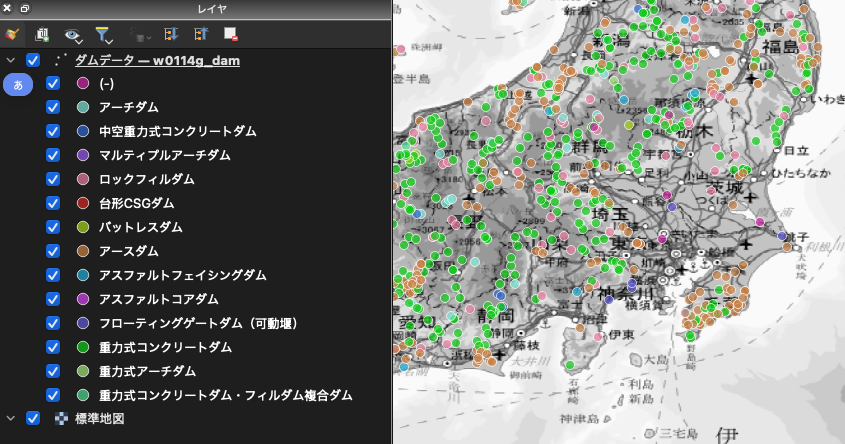
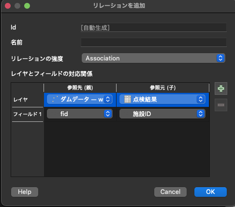

<!--
title:   QGIS for Facility Management Applications - QGISを用いた施設管理アプリケーションの作成
tags:    GIS,QGIS
id:      356d4efb2eb83439c85e
private: false
-->


:::note info
これは MIERUNE AdventCalendar 2024 6日目の記事です! 昨日は@Yfuruchinさんによる記事でした。
:::

# はじめに

行政機関・民間企業といった組織は多くのアセットを保有・管理していますね。
自治体なんかは、道路や橋梁、ダムといったアセットを定期的に点検・検査し、必要に応じて補修を行なっています。

これらのアセットは位置情報を持つものが非常に多いかと思います。
情報の管理手法としては、位置情報を紙の地図（または PDF）で管理し、点検結果などは Excel などのソフトを利用して、台帳として管理できます。このような手法で管理している自治体・民間企業は非常に多いと思います。

今回は、QGIS を使うと位置情報も点検結果の閲覧・登録・更新もまとめて整理できちゃうよ〜、ということを紹介してみます。
フォルダをしっかり整理すれば、点検結果の写真も QGIS で管理できちゃいます。

なお、基本的な QGIS に関する操作については割愛します。
QGIS の基本的な操作が知りたい方は、[QGIS LAB](https://qgis.mierune.co.jp/)っていうサイトの**学習パッケージ**に情報が整理されているので、そちらを見にいくと良いかな〜、と思います。


# 準備

## 使用データ

- [ダムデータ（国土数値情報）](https://nlftp.mlit.go.jp/ksj/gml/datalist/KsjTmplt-W01.html)

## 使用するソフト

- QGIS 3.34.12

# Let's make 施設管理アプリケーション

まずは QGIS に「使用データ」に記載したダムデータを GeoPackage に変換しつつ追加し、形式ごとに色分けしてみました。
背景図として、国土地理院が配信している「標準地図」を追加し、グレースケールにしました。



ダムデータと同じ GeoPackage に点検結果を入力するためのテーブルを新規作成しておきます。作成したテーブルは QGIS に追加します。
点検結果テーブルには、以下の属性を追加しておきます。

- 点検年度: 整数
- 点検結果： 整数
- メモ: テキスト
- 写真： テキスト（テキストなのは、写真の URL やパスを格納するため）

下図のように属性を追加します。


QGIS プロジェクトのプロパティを開き、リレーションの追加でダムデータと点検結果（を入力する予定の）のテーブルを紐づけます。
「名前」の部分には、識別しやすい名前を何か入力しておきます。今回は`点検`と入力しておきます。



ダムデータのレイヤプロパティを開き、属性フォームを`ドラッグ&ドロップデザイナー`に設定します。


フォームのレイアウトの右側にある`＋`ボタンをクリックし、ダムの基本情報を表示するタブを作成します。


作成したタブグループの中に、各種項目をドラッグ&ドロップで移動させます。


同様に点検結果のタブも追加しておきます。

利用可能なウィジェットのリレーションの中にあるリレーションアイテム（ここでは`点検`という名前にしている）をフォームのレイアウトにドラック&ドロップで追加します。


いったんここまでの設定で、どのようになるか確認してみます。
レイヤプロパティを閉じて、レイヤパネルでダムデータのレイヤを選択した状態で、「地物情報を表示」ボタンを ON にします。

この状態で、任意のダムデータの地物をクリックしてみると、下図のような地物フォームが開きます。
（地物フォームが開かない人は、地物情報結果パネルから下図のように設定を変えると良いと思います）


点検結果のタブをクリックすると、まだ情報がないので空っぽです。


点検結果の入力が便利になるよう、点検結果レイヤの属性フォームを修正しましょう。
点検結果レイヤのレイヤプロパティを開き、各属性を以下のように修正していきます。

- フォームのレイアウトから fid を削除します（自動採番されていくので利用者が気にするところではないため）。
- 点検年度：
  - ウィジェット型を`範囲`のままとして、最小値を 1900 とし、最大値を 3000 としておきます（とりあえず）。
- 施設 ID：
  - Display expression を fid にしておきます。ダムデータの fid とリレーションしているので、こちらが都合が良いのです。
- 点検結果：
  - ウィジェット型を`バリューマップ`に変更し、点検結果が入力しやすいよう、値と説明を以下に設定します。
    - 1：A
    - 2：B+
    - 3：B
    - 4：B-
    - 5：C
- メモ：
  - ウィジェット型は`テキスト編集`のままとし、マルチラインにチェックを入れます。これで複数行の文章が入力しやすくなります。
- 写真：
  - ウィジェット型を`アタッチメント`に変更し、統合ドキュメントビューアの方を画像に変更します。（その他、細かい設定はおまかせで！）

ここまでできたら、再度任意のダムデータの地物をクリックし、点検結果のタブに移動します。「編集モードの切り替え」「子地物を追加」ボタンをクリックし、点検結果を追加してみます。


色々と便利に入力できるようになっています。


点検結果は、プルダウンで選択できるようになってます。表記の揺れも心配ありません。


複数のデータを登録した後、カラムプレビューに「点検年度」を選択します。


すると、各データの点検年度から詳細情報にアクセスできるようになりました。わかりやすいですね。


写真も登録してみましょう。

管理しやすいように QGIS プロジェクトファイルと同じフォルダに、画像保存用のフォルダ`img`を作成し、年度フォルダと施設 ID でフォルダを作成しておきます。その中に目的の画像を保存しておきましょう（画像は生成 AI で作成しておきました）。

フォルダ構成としては、以下のようにしています。

```
.
├── Qiita施設管理.qgz
├── img
│   └── 2024
│       └── 612
│           └── sample.jpg
└── ダムデータ.gpkg
```

それでは QGIS で、施設 ID:612 のデータに写真を登録していきます。
入力フォームを開き、2024 年度の点検結果の写真に`img/2024/612/sample.jpg`のファイルを登録します（三点リーダーをクリックするとファイルが選択できます）。

すると以下のように画像が表示されます。
これにてやりたいことができました。


# まとめ

いかがでしたでしょうか？
今回の手順で作成した QGIS プロジェクトは、以下の特徴をもった良い感じの施設管理アプリケーションになったと思います。

- 施設の位置と点検結果が地図上で確認しやすい
- 施設の毎年の点検結果を更新しやすい

[Mergin Maps](https://merginmaps.com/)などの QGIS と連携できる現地調査アプリを組み合わせると、スマホから今回作成した地図の閲覧とデータの更新が行えます。

Mergin Maps を自分でサーバーを立てて活用する方法については、過去の記事で説明しています。参考にしてみてください。

[Mergin Maps CE (Community Edition) を EC2 にデプロイする](MerginMapsCE.md)

それでは、またどこかの記事でお会いしましょう 👋

:::note info
明日は@northprintさんによる記事です！お楽しみに！！
:::