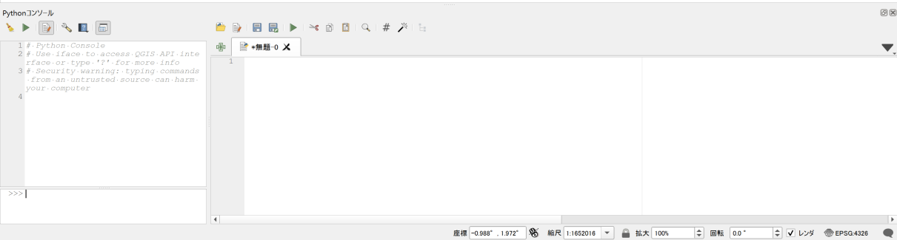
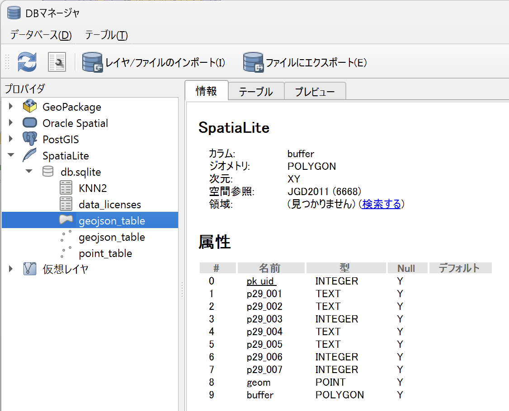
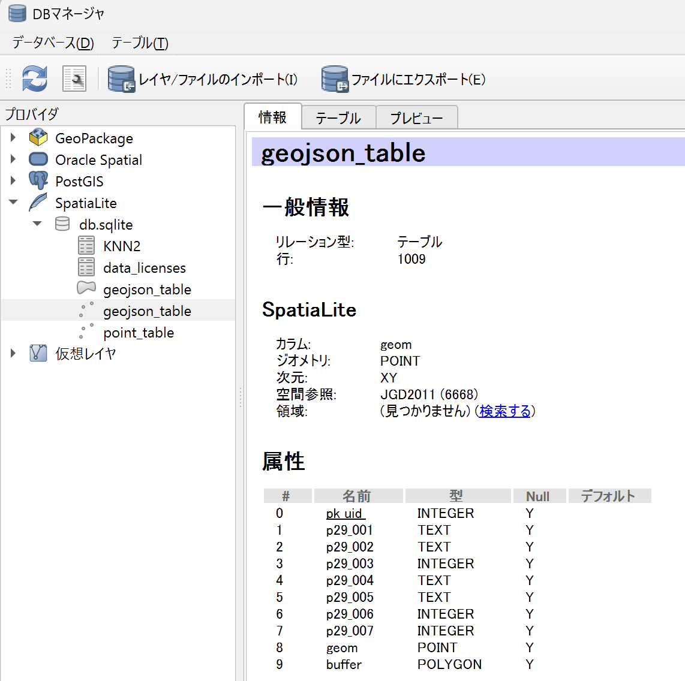
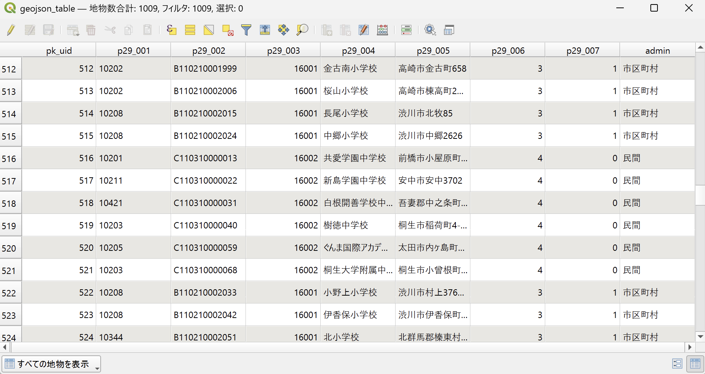

<!--
title:   QGISのPythonコンソールからSpatiaLiteを操作しよっ！
tags:    GIS,QGIS,SQLite,SpatiaLite
id:      c6ae216bcb9a447c6354
private: true
-->


# はじめに

個人的な作業メモです。
なお作業環境としては Windows かつ、QGIS のバージョンは 3.34.15 です。

# 作業メモ

## はじめかた

まずは QGIS を開き、Python コンソールを起動します。
そして、エディタを開きましょう。



エディタに以下を記述して、拡張機能である SpatiaLite を読み込みます。

```python
import sqlite3

db_path = r"C:hoge\db.sqlite"
con = sqlite3.connect(db_path)

# 拡張を有効
con.enable_load_extension(True)
cur = con.cursor()
cur.execute("SELECT load_extension('mod_spatialite')")

# メタデータの初期化
try:
    cur.execute("SELECT InitSpatialMetadata()")
except sqlite3.OperationalError as e:
    # すでに初期化済みの場合はエラーが出ることがある
    print("Spatial metadata initialization might already be done:", e)
```

これで、Cursor から、SpatiaLite を操作できるようになります。

:::note warn
Mac では、今のところ、Spatialite 拡張ライブラリが標準でインストールされていないようです。
[Installing and loading spatialite on MacOS](https://medium.com/@carusot42/installing-and-loading-spatialite-on-macos-28bf677f0436)の記事を参考に、インストールしてみてください。
:::

## テーブルの作成

SpatiaLite の `AddGeometryColumn`関数を使って、ジオメトリカラムを追加します。
これにより、対象のテーブルにジオメトリカラムを追加することができます。

`AddGeometryColumn`関数の Syntax は以下の通りです。

```sql
AddGeometryColumn(
    table String,
    column String,
    srid Integer,
    geom_type String
    [ , dimension String [ , not_null Integer ] ]
  ) : Integer
```

以下の例では、ポイントデータを格納するテーブルを作成し、ジオメトリカラムを追加しています。

```python
TABLE_NAME_POINT = "point_table"
# テーブルの作成
cur.execute(f"DROP TABLE IF EXISTS {TABLE_NAME_POINT}")  # 既存テーブルを削除する
cur.execute(f"CREATE TABLE {TABLE_NAME_POINT} (id INTEGER PRIMARY KEY, name TEXT)")
# ジオメトリカラムを追加（ここがSpatiaLiteの特徴）
cur.execute(f"""
    SELECT AddGeometryColumn('{TABLE_NAME_POINT}', 'geom', 4326, 'POINT', 'XY')
""")
```

上記の例では、SRID 4326 を使用したポイントデータ用のジオメトリカラム geom を追加しています。
なお、geom_type には以下のような値を指定できます。

- **ポイントデータ**
  - POINT
  - POINTZ
  - POINTM
  - POINTZM
- **ラインデータ**
  - LINESTRING
  - LINESTRINGZ
  - LINESTRINGM
  - LINESTRINGZM
- **ポリゴンデータ**
  - POLYGON
  - POLYGONZ
  - POLYGONM
  - POLYGONZM
- **マルチポイントデータ**
  - MULTIPOINT
  - MULTIPOINTZ
  - MULTIPOINTM
  - MULTIPOINTZM
- **マルチラインデータ**
  - MULTILINESTRING
  - MULTILINESTRINGZ
  - MULTILINESTRINGM
  - MULTILINESTRINGZM
- **マルチポリゴンデータ**
  - MULTIPOLYGON
  - MULTIPOLYGONZ
  - MULTIPOLYGONM
  - MULTIPOLYGONZM
- **ジオメトリコレクションデータ**
  - GEOMETRYCOLLECTION
  - GEOMETRYCOLLECTIONZ
  - GEOMETRYCOLLECTIONM
  - GEOMETRYCOLLECTIONZM
- **ジオメトリ**
  - GEOMETRY
  - GEOMETRYZ
  - GEOMETRYM
  - GEOMETRYZM

## CRUD 操作

### Create

データの登録は以下のように行います。
位置情報は SpatiaLite の `GeomFromText`関数を使って、WKT 形式で指定しています。

`GeomFromText`関数の Syntax は以下の通りです。

```sql
GeomFromText( wkt String [ , SRID Integer] ) : Geometry
```

```python
# データの登録例
cur.execute(f"""
    INSERT INTO {TABLE_NAME_POINT} (id, name, geom)
    VALUES (
        1,
        'Test Point',
        GeomFromText('POINT(139.767052 35.681167)', 4326)
    )
""")
```

### Read

データの参照（Read）については、特に特別な記述はありませんが、通常の SQL の SELECT 文を利用して行います。

### Update

データの更新は、UPDATE 文の SET 句で対象カラムを指定し、WHERE 句で更新対象を絞って実行します。

```python
# 例1: nameだけを更新する場合
cur.execute(f"""
    UPDATE {TABLE_NAME_POINT}
    SET name = ?
    WHERE id = ?
""", ("Updated Point Name", 1))
```

位置情報を更新する時は、登録の時と同様に、`GeomFromText`関数を使って、WKT 形式で指定します。

```python
# 例2: geom も更新する場合
cur.execute(f"""
    UPDATE {TABLE_NAME_POINT}
    SET name = ?,
        geom = GeomFromText(?, 4326)
    WHERE id = ?
""", ("Updated Point Name 2", "POINT(140.000 36.000)", 1))
```

### Delete

データの削除は、DELETE 文の WHERE 句で削除対象を指定して実行します。

```python
# データの削除
cur.execute(f"""
    DELETE FROM {TABLE_NAME_POINT}
    WHERE id = ?
""", (1,))
```

## 他のファイル形式からのデータ取り込み

### GeoJSON からのデータ取り込み

SpatiaLite の `ImportGeoJSON`GeoJSON からデータを取り込むことができます。

`ImportGeoJSON`関数の Syntax は以下の通りです。

```sql
ImportGeoJSON( filename Text , table Text ) : Integer

-- または

ImportGeoJSON(
    filename Text,
    table Text
    [ , geo_column Text
        [ , spatial_index Boolean
            [ , srid Integer
                [ , colname_case Text ]
            ]
        ]
    ]
) : Integer


```

:::note warn
注意点として、潜在的なセキュリティ問題があるため、デフォルトでは `ImportGeoJSON`関数は無効になっています。
環境変数 `SPATIALITE_SECURITY=relaxed`を明示的に設定することが必要ですが、利用の際は気をつける必要があります。
:::

以下は、GeoJSON ファイルを取り込む例です。（ 例として「[国土数値情報 学校データ](https://nlftp.mlit.go.jp/ksj/gml/datalist/KsjTmplt-P29-2023.html)のデータを使用）

```python
# SpatiaLite で ImportGeoJSON 関数を使うには、セキュリティ上の理由により以下の設定が必要
import sqlite3
import os
os.environ["SPATIALITE_SECURITY"] = "relaxed"

db_path = r"C:hoge\db.sqlite"
con = sqlite3.connect(db_path)

# 拡張を有効
con.enable_load_extension(True)
cur = con.cursor()
cur.execute("SELECT load_extension('mod_spatialite')")

# ~~ 省略 ~~

geojson_path = r"C:\hoge\hoge.geojson"
TABLE_NAME_GEOJSON = "geojson_table"
# GeoJSON の取り込み
cur.execute(f"""
    SELECT ImportGeoJSON(
        '{geojson_path}',     -- filename
        '{TABLE_NAME_GEOJSON}',  -- table
        'geom',               -- geo_column
        1,                    -- spatial_index (TRUE)
        6668,                 -- SRID
        'NONE'                -- colname_case
    );
""")
```

### Shapefile からのデータ取り込み

SpatiaLite の `ImportSHP` 関数を利用すると、Shapefile からデータを取り込むことができます。
こちらも、環境変数 `SPATIALITE_SECURITY=relaxed` を明示的に設定する必要があります。

`ImportSHP` 関数の構文は以下の通りです。

```sql
ImportSHP( filename Text , table Text , charset Text ) : Integer

-- または

ImportSHP(
    filename Text,
    table Text,
    charset Text
    [ , srid Integer
        [ , geom_column Text
            [ , pk_column Text
                [ , geometry_type Text
                    [ , coerce2D Integer
                        [ , compressed Integer
                            [ , spatial_index Integer
                                [ , text_dates Integer
                                    [ , colname_case Text
                                        [ , update_statistics Integer
                                            [ , verbose Integer ]
                                        ]
                                    ]
                                ]
                            ]
                        ]
                    ]
                ]
            ]
        ]
    ]
) : Integer


```

## 空間解析

[SQL functions reference list](https://www.gaia-gis.it/gaia-sins/spatialite-sql-5.1.0.html)に記載の通り、非常に多くの空間解析関数が利用できます。
これを組み合われれば、なんだってできてしまうのですが、ここでは簡単な例を紹介します。

### バッファの作成

`ImportGeoJSON`で取り込んだポイントデータに対して、バッファを作成してみます。
取り込んだデータは、`geojson_table`とします。

バッファは以下の Syntax で作成できます。

```sql
ST_Buffer( geom Geometry , dist Double precision [ , quadrantsegments Integer ] ) : Geometry
```

Spatialite では面白いことに、1 つのテーブルに複数のジオメトリカラムを持つことができます。
そのため、バッファを格納するカラムを追加して、バッファを作成します。

```python
# バッファの作成
cur.execute(f"""
    SELECT AddGeometryColumn('geojson_table', 'buffer', 6668, 'POLYGON', 'XY')
""")
cur.execute(f"""
    UPDATE geojson_table
    SET buffer = ST_Buffer(geom, 0.1)
""")
```

QGIS の DB マネージャで確認すると、`geojson_table`が 2 つ表示され、それぞれジオメトリのカラムに `geom`と `buffer`が表示されていることが確認できます。





バッファした結果を別のテーブルに格納する場合は、以下のようにします。

```python
# バッファの作成
cur.execute(f"""
    CREATE TABLE buffer_table AS
    SELECT *, ST_Buffer(geom, 0.1) AS buffer
    FROM geojson_table
""")
# POINTが格納されたgeomカラムを削除
cur.execute(f"""
    ALTER TABLE buffer_table DROP COLUMN geom;
    """)
# バッファされたPOLYGONが格納されたbufferカラムをgeomカラムにリネーム（わかりやすくすため）
cur.execute(f"""
    ALTER TABLE buffer_table RENAME COLUMN buffer TO geom;
""")
# 対象のテーブルをPOLYGONとして登録
cur.execute(f"""
    SELECT RecoverGeometryColumn('buffer_table', 'geom', 6668, 'POLYGON', 'XY')
""")
```

### 空間インデックスの作成

空間解析の処理を高速化するために、空間インデックスを作成しておくことは重要です。
空間インデックスの作成は以下のように行います。

```python
# 空間インデックスの作成
cur.execute(f"""
    SELECT CreateSpatialIndex('buffer_table', 'geom')
""")
```

## フィールド演算的なこと

`geojson_table`の`p29_006`カラムには、以下のようなコードが格納されているとします。

| コード | 対応する内容 |
| ------ | ------------ |
| 1      | 国           |
| 2      | 都道府県     |
| 3      | 市区町村     |
| 4      | 民間         |
| 0      | その他       |

`geojson_table` の `p29_006` カラムに格納されているコード（例：1=国、2=都道府県、3=市区町村、4=民間、0=その他）を、分かりやすい文字列に変換して新たな `admin` カラムに反映する方法を示します。

```python
# フィールド演算的なこと
cur.execute(f"""
    ALTER TABLE geojson_table ADD COLUMN admin TEXT
""")
cur.execute(f"""
    UPDATE geojson_table
    SET admin = CASE
        WHEN p29_006 = 1 THEN '国'
        WHEN p29_006 = 2 THEN '都道府県'
        WHEN p29_006 = 3 THEN '市区町村'
        WHEN p29_006 = 4 THEN '民間'
        ELSE 'その他'
    END
""")
```

QGIS でデータを確認してみます。
以下のように更新できました。


pyqgis からフィールド計算機で属性情報を更新しても良いのですが、新たなレイヤが生成されてしまい、元のレイヤ自体を更新することができません。SQL で更新してあげると、元のレイヤを更新することができます。

# おわりに

他にも色々と便利な使い方ができるので、色々と更新していこうと思います。